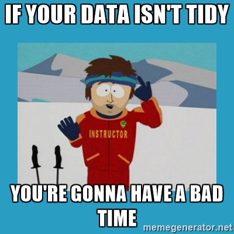

```{r setup, include=FALSE}
library(tidyverse)
```

#Session One: Introduction, Tidy Style, Pipes

##What is the tidyverse?
* The [tidyverse](http://tidyverse.org/) is the collective name given to suite of R packages designed mostly by Hadley Wickham.
* Before it was formalised in 2016 it was loosely referred to as the `hadleyverse`.
* Packages share a common API and design philosohpy intended to create a **"Pit of Success"**.

##Members of the tidyverse
broom, **dplyr**, forcats,
**ggplot2**, haven, httr,
hms, jsonlite, lubridate,
magrittr, modelr, purrr,
**readr**, readxl, stringr,
tibble, rvest, **tidyr**,
xml2

* **bold** indicates particularly famous members. 
* Which of these are we familiar with?

## Structure of This Course
*TODO

#Tidy Style

##Tidy Style
* Tidyverse code has a certain look:
```{r, eval = FALSE}
who %>%
  gather(code, value, new_sp_m014:newrel_f65, na.rm = TRUE) %>% 
  mutate(code = stringr::str_replace(code, "newrel", "new_rel")) %>%
  separate(code, c("new", "var", "sexage")) %>% 
  select(-new, -iso2, -iso3) %>% 
  separate(sexage, c("sex", "age"), sep = 1)
```
-[Grolemund, Wickham, 2016 R for Data Science](http://r4ds.had.co.nz/tidy-data.html#case-study)

##Style Guide
* The documentation of this style is still evolving.
* [This is a good start](https://rpubs.com/yeedle/tidyguide)

#Pipes %>%

##Pipes %>%
* Originally from the `magrittr` package but has been imported to the `tidyverse`.
* `%>%` is an **infix operator**. This means it takes two operands, left and right.
* Pipe feeds the **output** of the last expression/function (left) forward to the **first input** of the next funciton (right).
```{r, eval = FALSE}
1 %>% I() == I(1)
```

* can also control the input position of the next function with `.`:
```{r, eval = FALSE}
10 %>% rep(x = 1:10, .)
```

## Other infix operators:

```{r, eval=FALSE}
c(1,2) %*% t(c(3,4)) #vector/matrix multiplaction

"apple" %in% c("orange", "pear", "banana") #contains?

`%my_infix%` <- function(larg, rarg){ c(larg, rarg)} #anything!
1 %my_infix% c(2,3)
```

## Example
```{r, eval=FALSE}
mtcars %>% 
    mutate(pwr_2_weight = hp/wt) %>%
    arrange(pwr_2_weight) %>%
    head()
```

## Exercises

(1.) Rearrange this code so that it does not use `%>%`:

```{r unpipe, eval=FALSE}
mtcars %>% 
    mutate(pwr_2_weight = hp/wt) %>%
    arrange(pwr_2_weight) %>%
    head()
```

(2.) What are the advantages of the piping syntax?

## Why %>% helps in the tidyverse
* dataframes (tibbles) are the universal input and output format:
```{r, eval = FALSE}
iris #dataframe
iris_setosa <- filter(iris, Species == "setosa") #in: dataframe, out: tibble
iris_setosa_pet <- arrange(iris_setosa, Petal.Length) #in: tibble, out:tibble
head(iris_setosa_pet) #in: tibble, out: tibble, side effect: print to console
```
* Creating functional chains with `%>%` is easy when you don't have to worry about the input and output types.

## Pitfalls of %>%
* Since %>% is an operator, it has a position in the order of precedence. 
* This leads to some surprising results:
```{r}
a <- c(TRUE,FALSE,NA)
!is.na(a) %>% which()
```
* [R Operator Precedence](https://stat.ethz.ch/R-manual/R-devel/library/base/html/Syntax.html). Beware!
* Using `%>%` incurrs small processing overhead due to Non-Standard Evaluation. Reconsider use in fucntions for row-wise operations. 
* When using the debugger it can make code harder to trace.

## Benefits of %>% and Tidy Style
* Functions flow in natural order that tells story about data.
* Common style makes it easy to understand collaborator (or your own) code.

#Tidy Data

## Tidy Data
* The tools in the tidyverse are geared toward:
    - Turning data into tidy data
    - Plotting/Modelling/Analysing tidy data
    
<center></center>

## What is Tidy Data?


