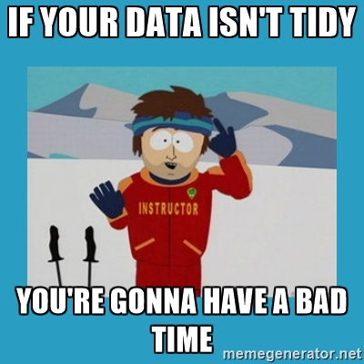

```{r setup, include=FALSE}
library(tidyverse)
library(knitr)
library(here)
COURSE_HOME <- here()
```

#Introductions

##Who am I?
* I love using R every day in my work as a research associate analysing agricultural data.
* I am one of the organisers of [BURGr](https://www.meetup.com/Brisbane-Users-of-R-Group-BURGr/).

@milesmcbain on Twitter and Github.

Affiliations:
<center></center>

#Session One: Introduction, Tidy Style, Pipes

##What is the tidyverse?
* The [tidyverse](http://tidyverse.org/) is the collective name given to suite of R packages designed mostly by Hadley Wickham.
* Before it was formalised in 2016 it was loosely referred to as the `hadleyverse`.
* Packages share a common API and design philosohpy intended to create a **"Pit of Success"**.

##Members of the tidyverse
broom, **dplyr**, forcats,
**ggplot2**, haven, httr,
hms, jsonlite, lubridate,
magrittr, modelr, purrr,
**readr**, readxl, stringr,
tibble, rvest, **tidyr**,
xml2

* **bold** indicates particularly famous members. 
* Which of these are we familiar with?

## Structure of This Course
3x Sessions intended to run about 50min each.

* Session 1: Tidyverse style, Pipes (`%>%`), Tidy Data, Tidyr
* Session 2: Dplyr, ggplot2
* Session 3: Advanced Dplyr, Advanced Tidyr, purrr, modelr

#Tidy Style

##Tidy Style
* Tidyverse code has a certain look:
```{r, eval = FALSE}
who %>%
  gather(code, value, new_sp_m014:newrel_f65, na.rm = TRUE) %>% 
  mutate(code = stringr::str_replace(code, "newrel", "new_rel")) %>%
  separate(code, c("new", "var", "sexage")) %>% 
  select(-new, -iso2, -iso3) %>% 
  separate(sexage, c("sex", "age"), sep = 1)
```
-[Grolemund, Wickham, 2016 R for Data Science](http://r4ds.had.co.nz/tidy-data.html#case-study)

##Style Guide
* The documentation of this style is still evolving.
* [This is a good start](https://rpubs.com/yeedle/tidyguide)

#Pipes %>%

##Pipes %>%
* Originally from the `magrittr` package but has been imported to the `tidyverse`.
* `%>%` is an **infix operator**. This means it takes two operands, left and right.
* 'Pipes' the **output** of the last expression/function (left) forward to the **first input** of the next funciton (right).
```{r, eval = FALSE}
1 %>% I() == I(1)
```

* Can control the input position of the next function with `.`:
```{r, eval = FALSE}
10 %>% rep(x = 1:10, .)
```

## Other infix operators:

```{r, eval=FALSE}
c(1,2) %*% t(c(3,4)) #vector/matrix multiplaction

"apple" %in% c("orange", "pear", "banana") #contains?

`%my_infix%` <- function(larg, rarg){ c(larg, rarg)} #anything!
1 %my_infix% c(2,3)
```

## Example
```{r, eval=FALSE}
mtcars %>% 
    mutate(pwr_2_weight = hp/wt) %>%
    arrange(pwr_2_weight) %>%
    head()
```

## Exercises

(1.) Rearrange this code so that it does not use `%>%`:

```{r unpipe, eval=FALSE}
mtcars %>% 
    mutate(pwr_2_weight = hp/wt) %>%
    arrange(pwr_2_weight) %>%
    head()
```

(2.) What are the advantages of the piping syntax?

## Why %>% helps in the tidyverse
* dataframes (tibbles) are the universal input and output format:
```{r, eval = FALSE}
iris #dataframe
iris_setosa <- filter(iris, Species == "setosa") #in: dataframe, out: tibble
iris_setosa_pet <- arrange(iris_setosa, Petal.Length) #in: tibble, out: tibble
head(iris_setosa_pet) #in: tibble, out: tibble, side effect: print to console
```
* Creating functional chains with `%>%` is easy when you don't have to worry about the input and output types.

## Pitfalls of %>%
* Since `%>%` is an operator, it has a position in the order of precedence. 
* This leads to some surprising results:
```{r}
a <- c(TRUE,FALSE,NA)
!is.na(a) %>% which()
```
* [R Operator Precedence](https://stat.ethz.ch/R-manual/R-devel/library/base/html/Syntax.html). Beware!
* Using `%>%` incurrs small processing overhead due to Non-Standard Evaluation. Reconsider use in fucntions for row-wise operations. 
* When using the debugger it can make code harder to trace.

## Benefits of %>% and Tidy Style
* Functions flow in natural order that tells story about data.
* Code effects are easy to reason about by inserting `View()`/`head()` into pipe chain.
* Common style makes it easy to understand collaborator (or your own) code.

#Tidy Data

## Tidy Data
* The tools in the tidyverse are geared toward:
    - Turning data into tidy data
    - Plotting/Modelling/Analysing Tidy Data
    
<center></center>

## What is Tidy Data?
* [Hadley Wickham's 2014 JSS Paper](https://www.jstatsoft.org/article/view/v059i10)
    - 1 observation = 1 row
    - 1 variable = 1 column
    
## Is This Tidy Data?
```{r, echo=FALSE}
knitr::kable(head(mtcars))
```

## Is This Tidy Data?
```{r, echo=FALSE}
knitr::kable(tribble(
    ~FY, ~Week, ~Mon, ~Tue, ~Wed, ~Thur, ~Fri, ~Sat, ~Sun,
    1617,    1,   40,   45,   58,    74,   92,   80,  116,
    1617,    2,   38,   42,   63,    76,   88,   90,  120,
    1617,    3,   32,   43,   59,    68,   102,  78,   91
))
```

## Tidied! (almost)
```{r, echo=FALSE}
knitr::kable(tribble(
    ~FY, ~Week, ~Mon, ~Tue, ~Wed, ~Thur, ~Fri, ~Sat, ~Sun,
    1617,    1,   40,   45,   58,    74,   92,   80,  116,
    1617,    2,   38,   42,   63,    76,   88,   90,  120,
    1617,    3,   32,   43,   59,    68,   102,  78,   91
) %>% gather(key = "Day", value = "Sales", Mon:Sun)
)
    
```

## Is This Tidy Data?
```{r, echo = FALSE}
 knitr::kable(as.data.frame(Titanic) %>% 
              arrange(Class) %>%
              head())

```

## Tidied!
```{r, echo=FALSE}
 knitr::kable(as.data.frame(Titanic) %>% 
              arrange(Class) %>%
              spread(key = Survived, value = Freq) %>%      
              head())
```

## Tidying Data
* The package for tidying data is `tidyr`. With it you can:
    - `gather()` columns up into rows (stack, melt, unpivot)
    - `spread()` rows out over columns (unstack, cast, pivot)
    - `seprate()` one column into many
    - `unite()` many columns into one
    - `fill()` and `drop_na()` values
    - And more!


## Exercise
We're going to tidy the data in `PRAC_HOME/data/tb_who.csv`.

starter code:
```{r, eval=FALSE}
tb_cases <- read_csv(file.path(COURSE_HOME,"data/tb_who.csv"))
View(tb_cases)
```
[Cheatsheet](https://www.rstudio.com/wp-content/uploads/2015/02/data-wrangling-cheatsheet.pdf)

* What are the issues with this data?
* What `tidyr` methods can be used to fix it?


