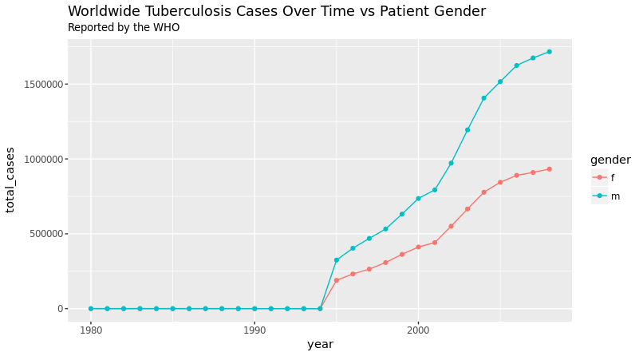

```{r setup, include=FALSE}
library(tidyverse)
library(knitr)
library(here)
COURSE_HOME <- here()
```

#Data Munging

## Datasets
This section is about shaping data. Let's familise ourselves with the data our examples will work on:
```{r}
mtcars
airquality
mpg
```

## Dplyr
* `dplyr` is the data wrangling workhorse of the tidyverse.
* Prodvides functions, **verbs**, that can maipulate tibbles into the shape you need for analysis.
* Has many backends allowing dplyr code to work on data stored in SQL databases and big data clusters.
    - Works via translation to SQL. Keep an eye out for the SQL flavour in `dplyr`

##Basic Vocab
* `select()` columns from a tibble 
* `filter()` to rows matching a certain condition
* `mutate()` a tibble by changing or adding rows
* `arrange()` rows in order
* `group_by()` a variable
* `summarise()` data over a group using a function

##Select
Subset the data to selected columns.
```{r, eval=FALSE}
iris %>% 
    select(Sepal.Width, Species) %>%
    select(-Species) %>%
    head()
```
* What is the output of this code?
* Note the use of *bare* *unquoted* variable names.
    - No `iris$Species` or `iris[,"Species"]`
    - How does this even work?

##Filter
Subest the data to rows matching logical conditions.
```{r, eval=FALSE}
airquality %>%
    filter(Temp > 60) %>%
    filter(!is.na(Ozone), !is.na(Solar.R)) %>%
    filter(Wind > 10 | Ozone < 20) %>%
    filter(Day %in% c(1,2,3,4,5,6,7))

tb_cases <- read_csv(file.path(COURSE_HOME,"data/tb_who.csv"))
tb_cases %>%
    filter( grepl(x = iso2, pattern = "^A") ) #grep logical
```
* Filter argument must resolve to a logical vector
* In the case of multiple arguments, they are **ANDED** together 
    - What does this mean?

##Mutate
Add or update columns.
```{r, eval=FALSE}
mtcars %>%
    mutate( power_2_weight = hp/wt,
           `fully sick` = if_else(power_2_weight > 50, true = "yes", false = "no"),
           make = row.names(mtcars),
           one = 1)
           
airquality %>%
    mutate(Temp_lag1 = lag(Temp))
```
* Each argument defines a column
    - Each right hand side definition needs to return a vector of length `nrow()` or 1.
    
##Exercise

(1.) Using `mtcars` and the new varibale `power_2_weight`, create a column that is the z-score of `power_2_weight`.

* When would this be a good idea?

(2.) **Extension**: Use the function `mutate_at()` to create lagged versions of all non-time measures in `airquality` simultaneously. Use help(mutate_at) to determine how to use it. 

##Group by and Summarise
Create groups of rows to summarise over.
```{r, eval = FALSE}
mtcars %>%
    group_by(cyl) %>%
    summarise(mean_mpg = mean(mpg))

mtcars %>%
    group_by(cyl, am) %>%
    summarise(median_mpg = median(mpg),
              quantile80 = quantile(mpg, c(0.8))
    )
```
* Tibbles stay grouped until groups are removed by `summarise()` or `ungroup()` is called.
* Groups apply to `mutate()` calls, functions will be applied over groups [example].
   - You'll take advantage of this more often than `summarise()`

##Arrange
Arranges data in order according to specified colums.
```{r, eval = FALSE}
airquality %>%
    arrange(Temp)

airquality %>%
    arrange(Month, desc(Temp))
```

**Exercise:**

(3.) Determine the hottest 3 days of every month in the `airquality` dataset
   
* There is more than one way to do this.
* What if I asked for just the hottest?

##Conditional Mutate?
A common question is: "How can I conditionally mutate a row of data?"

Two options: `if_else()` and `recode()`

```{r, eval=F}
airquality %>%
    mutate(Temp = if_else(Temp > 90, true = as.integer(NA), false = Temp))

iris %>%
    mutate(Species = recode(Species, setosa = "S", versicolor = "V")) %>%
    group_by(Species) %>%
    slice(1)
```
* Why did we have to do `as.integer(NA)`?

##Tidyr vs Dplyr
* **Remember:** if it feels like you're fighting the tidyverse you're probably doing it wrong. 

```{r}
index_data <- tribble(
    ~metric, ~`2011`, ~`2014`, ~`2016`,
      "DTI",      75,      65,      50,
      "LVR",      60,      60,      80,
     "rate",   0.076,   0.069,   0.045
    )
```

(4.) Create a dataset that contains new metrics that are the delta of (2016 - 2014, 2014 - 2011).


##Planning for Plotting
* Most likely one of the things you are keen to do with the `tidyverse` is plot.
* `ggplot2` loves tidy data. Every **aesthetic** about a plot you want to be controlled by data should be a **column**.
    - Why does this make sense?

##Tuberulosis Data


What columns would we need to have in the data?

## Exercise

(5.) Create the plot from the previous slide using `dplyr` and `ggplot2`.

Starter Code:
```{r, eval=FALSE}
tb_cases <- read_csv(file.path(COURSE_HOME,"data/tb_who.csv"))

tb_cases_tidy <-
    tb_cases %>%
    gather(key = "group", value = "num_cases", m04:fu) %>%
    separate(col = group, into = c("gender", "age_group"), sep = 1)
```

# ggplot2

## A Crash Course on ggplot2
* It might seem weird to jump to ggplot2. Now is the perfect time to discuss it.
* Most struggles with ggplot2 are really struggles with data!
* ggplot2 is a system that provides **mappings** from your data to **aesthetics**.


## The Worst Plot Ever
```{r, echo = false}
    mpg %>%
    ggplot() +
    geom_point(mapping = aes(x = year, y = cty))
```

## Things to do
* Got to [ggplot2 documentation](http://docs.ggplot2.org/current/).
* Choose a better geom_
* Facet by manufacturer
* Facet by mileage and manufacturer
* Choose a theme!

##Take away from crash course
* Plots are built iteratively. It's a creative process.
* The data drives the visualisation.
    - Make sure it is tidy!
* Learn the concepts of ggplot2. The details are there in the documentation when you need them.

