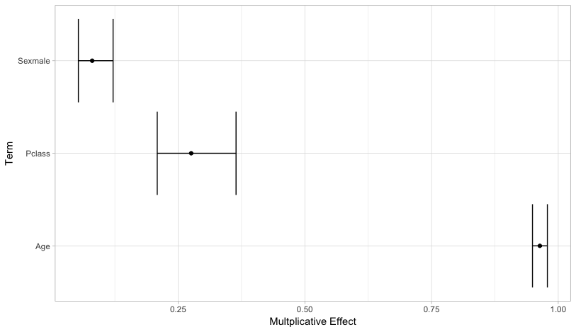

```{r setup, include=FALSE}
library(tidyverse)
library(broom)
library(knitr)
library(here)
library(modelr)
COURSE_HOME <- here()
```

#Advanced Tidy Data Structures

#Purrr

##List Programming
`purrr` is the Tidyverse answer to the `apply` family from base R. It contains an array of tools to make applying functions to lists, vectors, and dataframes clear and fit with other tasks in the tidyverse.

* the `map()` family are similar to `apply()` but gives you explicit control of the returned data structure. 

Examples:
```{r, eval=FALSE}
airquality %>%
    map(is.na)

airquality %>%
    map_df(is.na)
```

##Formula syntax
Function prototypes can be provided to `map()` with a formula syntax, making 
```{r, eval=FALSE}
list(low = 1, med = 1.5, high = 2) %>%
    map( ~rnorm(mean = 0, sd = ., n=100))

```

Exercise: (1.) Plot the densities of the sampled distributions overlaid in ggplot2.

##Map + Mutate
The control of return type, `map()` makes it very powerful in combination with `dplyr::mutate()`. In this example we want to find out how many dependencies each of the tidyverse packages have on CRAN.

```{r, eval=FALSE}

```


##Indexing lists

##pmap

##Map/Reduce


##Do you even lift()?


#Purrr + Tidyr: NEST, UNNEST


#Tidy Models

## Hello old friend | A linear model (logistic regression) {.codefont}
```{r, echo=FALSE, message=FALSE}
titanic_data <- read_csv(file.path(COURSE_HOME,"data/train.csv"))
```
```{r, echo=FALSE}
logistic_fit <- glm(data = titanic_data,
            formula = Survived ~ Age + Sex + Pclass,
            family=binomial(link = "logit")
   )
summary(logistic_fit)
```

##Tidy Models with Broom
`broom` is a package for creating tidy data frames model of output.
* tidy data means complete freedom in plotting and analysis of model diagnostics


##Augment data with diagnostics
`augment()` puts model diagnostics along side data

* great for exploring model fit with plots.
```{r, eval=FALSE}
aug_model <- augment(logistic_fit, type.predict = "response")
ggplot(aug_model) +
    geom_bar( mapping = aes(x = 1:nrow(aug_model), y = .cooksd), stat = "identity")
```

* How would we find the high leverage points in the above plot?

##Convert a model to tidy data
`tidy()` creates a tidy version of `summary()`
```{r}
tidy_logistic_fit <- tidy(logistic_fit)
```

##Exercise
(1.) Reproduce this plot for the effects from the `tidy()` output:


##Exercise
Starter Code:
```{r, eval=FALSE}
tidy_logistic_fit %>%
  filter( term != "(Intercept)") %>%        
  mutate(effect.lwr_ci = exp(estimate - 2*std.error),
         effect = exp(estimate),
         effect.upr_ci = exp(estimate + 2*std.error)) %>%
  ggplot()
```


##Model -> One Row
* `glance()` creates a data frame with a 1 row summary
    - The strength of this becomes apparent when comparing *many* models
```{r}
glance(logistic_fit)
```

#Modelr

##Tidy Modelling
* `modelr` is a new way to look at fitting and evaluating sets of models.
* It provides facilities for creating training, test and cv datasets in tidy data frames

#K-fold-CV
```{r}
titanic_cv_data <-
    titanic_data %>%
    crossv_kfold(k = 3)
```

#Nesting and Unnesting
`tidyr` contains two functions that allow us to deal with new types of nested data frames.


